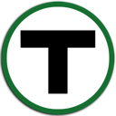

Greenline image:https://img.shields.io/github/release/formwork-io/greenline.svg[release] image:https://img.shields.io/github/license/formwork-io/greenline.svg[license] 
=======================================================================================================================================================================

link:https://github.com/formwork-io/greenline[Greenline] is an agnostic relay
for interconnecting disparate software components. It abstracts the useful
parts of distributed systems to enable flexible patterns in designing,
scaling, and maintaining advanced system architectures.

Software systems of all sizes can benefit from an integrated
link:https://github.com/formwork-io/greenline[Greenline] (or similar
technologies). The challenges around the growth and evolution of software,
previously difficult by nature, become tractable as the design
unburdens the designer. These same challenges become trivial.

Some common examples where a
link:https://github.com/formwork-io/greenline[Greenline]-infused design can
benefit:

* Bridging to legacy software
* Interconnecting components regardless of programming languages
* Enabling microservices
* Addressing scaling concerns

The Name
--------

Greenline is named after the oldest subway line of the same name in
Boston, Massachusetts. 

